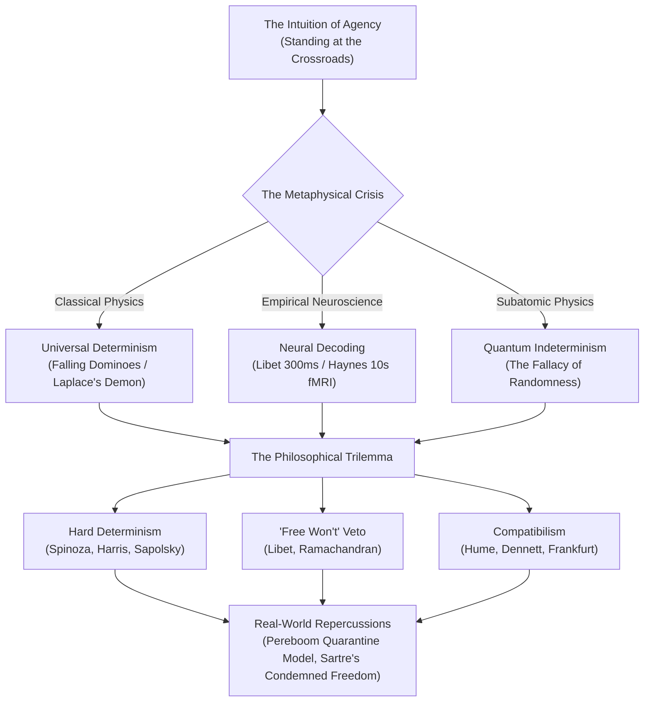

# 🧠 Free Will: Real or Fake?
## Formal Master Lecture Documentation & Academic Curriculum Guide

> **Document Class:** Academic Master Lecture Monograph & Presenter Curriculum  
> **Topic:** Metaphysics, Cognitive Neuroscience, Behavioral Biology, and Moral Jurisprudence  
> **Core Inquiry:** Do human beings exercise genuine autonomous agency in their choices, or is conscious volition an illusory byproduct of deterministic physical, biological, and historical chains of causality?

---

## 📑 Table of Contents
1. [Lecture Overview & Executive Summary](#1-lecture-overview--executive-summary)
2. [Module 1: Defining Free Will & The Crossroads Sensation](#2-module-1-defining-free-will--the-crossroads-sensation)
3. [Module 2: Universal Determinism & The Domino Cascade](#3-module-2-universal-determinism--the-domino-cascade)
4. [Module 3: Classical Neuroscience — Benjamin Libet's 300ms Gap (1983)](#4-module-3-classical-neuroscience--benjamin-libets-300ms-gap-1983)
5. [Module 4: 21st-Century Neuroscience — Haynes (2008) & Fried (2011)](#5-module-4-21st-century-neuroscience--haynes-2008--fried-2011)
6. [Module 5: The Scientific Rebellion — Aaron Schurger's Stochastic Model (2012)](#6-module-5-the-scientific-rebellion--aaron-schurgers-stochastic-model-2012)
7. [Module 6: Quantum Physics — The Fallacy of Randomness](#7-module-6-quantum-physics--the-fallacy-of-randomness)
8. [Module 7: The Philosophical Trilemma (Hard Determinism, Free Won't, Compatibilism)](#8-module-7-the-philosophical-trilemma)
9. [Module 8: Harry Frankfurt (1969) — Freedom Without Alternate Possibilities](#9-module-8-harry-frankfurt-1969--freedom-without-alternate-possibilities)
10. [Module 9: Biocultural Determinism — Robert Sapolsky (2023)](#10-module-9-biocultural-determinism--robert-sapolsky-2023)
11. [Module 10: Rules, Justice, & Derk Pereboom's Quarantine Model](#11-module-10-rules-justice--derk-perebooms-quarantine-model)
12. [Module 11: Existentialism — Jean-Paul Sartre and "Condemned to Be Free"](#12-module-11-existentialism--jean-paul-sartre-and-condemned-to-be-free)
13. [Module 12: Psychological Stakes — Illusionism (Smilansky) vs. Radical Empathy](#13-module-12-psychological-stakes--illusionism-smilansky-vs-radical-empathy)
14. [Module 13: Grand Synthesis & The Open Verdict](#14-module-13-grand-synthesis--the-open-verdict)
15. [Presenter Master Guide: 14-Slide Verbatim Lecture Script](#15-presenter-master-guide-14-slide-verbatim-lecture-script)

---

## 1. Lecture Overview & Executive Summary

The free will debate stands at the ultimate crossroads of human thought. It governs whether praise, blame, pride, guilt, love, and retributive justice are rational, or whether humans are simply organic automata rationalizing actions after the fact.

---

## 2. Module 1: Defining Free Will & The Crossroads Sensation
- **The Crossroads Phenomenon:** When standing at a physical fork in the road, human consciousness experiences an intuitive certainty: *"Under the exact same physical conditions, I could have chosen otherwise."*
- **Principle of Alternate Possibilities (PAP):** The traditional libertarian assertion that moral responsibility requires the genuine metaphysical ability to have chosen an alternate action.

---

## 3. Module 2: Universal Determinism & The Domino Cascade
- **Principle of Universal Causality:** Every state of the physical cosmos is mathematically dictated: $\text{State}_t = f(\text{State}_{t-1}, \text{Physical Laws})$.
- **The Domino Analogy:** In an unbroken chain of falling dominoes, Domino #14 does not "choose" to fall; it is physically compelled by kinetic transfer from Domino #13. Because human brains are composed of physical atoms and neurons, determinism asks: aren't your choices simply Domino #14 in an unbroken sequence stretching back to the Big Bang?
- **Laplace's Demon (1814):** An intellect with complete knowledge of all particles at one moment could calculate the entire past and future with 100% precision. Uncertainty is merely human ignorance.

---

## 4. Module 3: Classical Neuroscience — Benjamin Libet's 300ms Gap (1983)
- **The Experiment:** Subjects watched an oscilloscope clock with a spot rotating every 2.56 seconds. They were instructed to flick their wrist whenever spontaneous intention arose.
- **The Readiness Potential (Bereitschaftspotential):** Electrical activity in the Supplementary Motor Area (SMA) began **300 to 500 milliseconds before** the subject reported conscious awareness of their intention.
- **The Press Secretary Hypothesis:** Consciousness is not the commanding general of action; it is merely the press secretary justifying decisions already initiated by unconscious neural circuitry.

---

## 5. Module 4: 21st-Century Neuroscience — Haynes (2008) & Fried (2011)
- **John-Dylan Haynes (2008 / 2011 fMRI Decoding):** Max Planck researchers decoded whether subjects would press a left or right button up to **7 to 10 seconds** before conscious awareness by reading fMRI signals in the frontopolar cortex (BA10) and precuneus.
- **Itzhak Fried (2011 Single-Neuron Intracranial Recording):** Direct recording from 256 neurons in human neurosurgical patients predicted motor decisions **700ms** before awareness with >80% accuracy.

---

## 6. Module 5: The Scientific Rebellion — Aaron Schurger's Stochastic Model (2012)
- **The Stochastic Accumulator:** What if the Readiness Potential is not an unconscious decision at all?
- The brain generates ongoing spontaneous neural noise (slow cortical fluctuations). In waiting tasks with no external cue, movement triggers whenever ongoing neural noise randomly crests above a threshold.
- Averaging EEG backwards from movement artificially creates the visual illusion of a purposeful buildup. The feeling of intention is constructed at the exact threshold crossing!

---

## 7. Module 6: Quantum Physics — The Fallacy of Randomness
- **The Heisenberg Appeal:** Some argue that quantum indeterminacy and wave-function collapse break determinism, thereby "saving" free will.
- **The Logical Fallacy:** **Randomness is NOT Free Will.**
- If an action is caused by an unpredictable subatomic radioactive decay in a synapse, you did not author that decay. Being ruled by subatomic dice is no freer than being ruled by deterministic dominoes.

---

## 8. Module 7: The Philosophical Trilemma
1. **Hard Determinism (Incompatibilism):** Free will is zero. Physics, biology, and past history completely mandate every action.
2. **"Free Won't" (Inhibitory Agency):** While the unconscious mind generates impulses, consciousness possesses a 150ms veto window to inhibit and abort action before motor execution.
3. **Compatibilism (Soft Determinism):** Free will does not mean escaping physics; it means acting according to your own internal desires and character without external physical coercion.

---

## 9. Module 8: Harry Frankfurt (1969) — Freedom Without Alternate Possibilities
- **The Case of Black & Jones:** Neurosurgeon Black implants a dormant chip in voter Jones. If Jones votes Candidate A on his own, the chip does nothing. If Jones hesitates toward Candidate B, the chip forces him to vote Candidate A.
- **The Counterexample:** Jones votes Candidate A voluntarily. Black never intervenes. Could Jones have done otherwise? **NO.** Was Jones morally responsible? **YES.**
- **The Takeaway:** Moral responsibility does NOT require alternate possibilities. Freedom is being the authentic author of your desires.

---

## 10. Module 9: Biocultural Determinism — Robert Sapolsky (2023)
In *Determined*, Robert Sapolsky demonstrates that any human behavior is the convergence of an unbroken hierarchy:
- 1 Second Before: Action potentials in the amygdala vs prefrontal cortex.
- Minutes Before: Sensory priming, ambient odors, and room temperature.
- Hours to Days Before: Circulating testosterone, cortisol, and blood glucose.
- Weeks to Months: Neuroplastic dendritic arborization.
- Adolescence: Delayed prefrontal myelination.
- Fetal & Genetics: Epigenetic methylation tags and ancestral alleles.
- Millennia Before: Evolutionary ecology of ancestral populations.
*There is no uncaused seam where a soul enters the physical machinery.*

---

## 11. Module 10: Rules, Justice, & Derk Pereboom's Quarantine Model
- **The Death of Retribution:** Inflicting suffering on an offender because they "deserve" pain is morally indefensible if their behavior was compelled by trauma, genetics, and environment.
- **Derk Pereboom's Public Health Quarantine Analogy:**
  - When an individual carries a deadly pathogen (e.g. Ebola), society quarantines them to protect public safety.
  - We do not hate them, seek vengeance, or torture them. We isolate them humanely, provide medical care, and cure them if possible.
  - Criminal jurisprudence must abandon medieval retribution in favor of quarantine containment, general deterrence, and neurological rehabilitation.

---

## 12. Module 11: Existentialism — Jean-Paul Sartre and "Condemned to Be Free"
- **"Man is condemned to be free; because once thrown into the world, he is responsible for everything he does."** (*Being and Nothingness*, 1943)
- **Facticity vs. Meaning:** While our starting facts (genes, birth era, past trauma) are unchosen, we are perpetually forced to assign meaning and choose our next response.
- **Bad Faith (Mauvaise Foi):** Hiding behind determinism, genetics, or circumstance to dodge the terrifying anxiety (*angst*) of absolute personal responsibility.

---

## 13. Module 12: Psychological Stakes — Illusionism (Smilansky) vs. Radical Empathy
- **The Dark Side (Vohs & Schooler 2008):** Priming subjects with deterministic text increased cheating, reduced altruism, and fostered moral passivity.
- **Saul Smilansky's 'Free Will Illusionism':** Argues that free will is a necessary social fiction that humanity must maintain to preserve social order.
- **The Bright Side (The Gift of Determinism):** Shedding the illusion of free will destroys toxic pride, dissolves vindictive hatred, and fosters radical compassion for all human suffering.

---

## 14. Module 13: Grand Synthesis & The Open Verdict
Agency redefined: We are not supernatural ghosts operating outside physical laws. We are self-reflective deterministic agents equipped with biological feedback loops, capable of modeling future consequences, exercising conscious vetoes, and steering our trajectories.

---

## 15. Presenter Master Guide: 14-Slide Verbatim Lecture Script

| Slide | Title | Core Pedagogical Thesis | Suggested Presenter Delivery (Verbatim Excerpt) |
| :---: | :--- | :--- | :--- |
| **01** | Title / Introduction | The Metaphysical Crossroads | *"Welcome everyone. Today we examine whether humans make their own choices, or if conscious volition is a sophisticated neurological illusion..."* |
| **02** | The Intuition | The Crossroads Phenomenon | *"Start with our everyday intuition. You feel with absolute conviction: 'I could have chosen otherwise.' But is this intuition scientifically true?"* |
| **03** | Physical Causality | Universal Determinism | *"In classical physics, the universe is an unbroken causal chain. If every atom obeys physics, are your choices simply domino #14 falling since the Big Bang?"* |
| **04** | Classical Neuroscience | Libet's 300ms Gap | *"Libet found that the brain's motor cortex initiates electrical preparation 300ms before you consciously feel you decided. Is consciousness merely a press secretary?"* |
| **05** | Modern Neuroscience | Haynes 10s fMRI Decoding | *"Haynes used fMRI machine learning to predict button choices up to 10 seconds before conscious awareness. The predictive window is expanding from milliseconds to seconds."* |
| **06** | Scientific Counter-Rebellion | Schurger's Stochastic Model | *"Plot twist: What if the Readiness Potential isn't a decision at all, but random neural noise cresting above a threshold? Intention is born at the threshold crossing."* |
| **07** | Physics Inquiry | Quantum Randomness Fallacy | *"Heisenberg's uncertainty does not save free will. Randomness is the enemy of intention. Being ruled by subatomic dice is no freer than being ruled by dominoes."* |
| **08** | Philosophical Trilemma | 3 Stances | *"Hard Determinism says free will is zero. Free Won't says we have 150ms veto power. Compatibilism says being free just means acting on your desires without chains."* |
| **09** | Frankfurt Cases | Freedom Without Alternatives | *"Harry Frankfurt proved that moral responsibility does not require alternate possibilities through the famous case of voter Jones and neurosurgeon Black."* |
| **10** | Biocultural Determinism | Robert Sapolsky (2023) | *"Every choice is the convergence of a hierarchy: from action potentials 1 second prior to evolutionary ecology millennia ago. Find one neuron free from this chain."* |
| **11** | Rules, Law, & Justice | The Quarantine Model | *"Retributive punishment is irrational cruelty under determinism. Derk Pereboom's Quarantine Model treats crime as a public health containment and rehabilitation issue."* |
| **12** | Existentialism | Sartre: "Condemned to Be Free" | *"Jean-Paul Sartre declared: 'Man is condemned to be free.' Hiding behind determinism or trauma to dodge accountability is what Sartre called Bad Faith."* |
| **13** | Psychological Stakes | Illusionism vs. Liberation | *"Vohs and Schooler showed that losing free will increases cheating. Yet accepting determinism destroys arrogance and fosters boundless compassion for human suffering."* |
| **14** | Grand Synthesis | The Open Verdict | *"We are not supernatural ghosts; we are self-reflective deterministic agents. The choice of how you interpret your agency is now yours. Thank you."* |

---

---

## 16. Visual Architecture & Clinical Aesthetic Philosophy

The visual interface is built with an ultra-high performance, zero-lag, clinical and existential aesthetic. It directly reflects the philosophical concepts through a symbolic color palette:

| Color Component | Hex / Value | Philosophical & Scientific Meaning |
|---|---|---|
| **Deep Charcoal / True Black** | `#06070a`, `#0b0d13` | Reflects the heavy, inescapable existential burden of choice (Jean-Paul Sartre) and the deep, silent mystery of the unconscious brain. |
| **Clinical White & Silver** | `#ffffff`, `#cbd5e1`, `#94a3b8` | Provides stark contrast and mirrors the scientific, objective lens used to examine the 300-millisecond time gap and the rigid rules of hard determinism. |
| **Steel Blue (Primary Accent)** | `#507d9b`, `#6ea0bf` | A cold, detached color that fits the mechanical, inevitable chain of events represented by the falling dominoes and the strict nature of the justice system. |
| **Desaturated Forest Green (Secondary Accent)** | `#4b6b52`, `#638a6b` | A muted, isolated color that ties directly back to the visual of the traveler standing at the forest crossroads, grounding abstract metaphysics in the lived human feeling of choice. |

### Technical Performance
- **Zero-Lag Architecture:** Completely static CSS background (no canvas shaders or continuous WebGL render loops), consuming 0% idle CPU and GPU resources.
- **Data-Driven Visualizations (Chart.js):** 6 interactive clinical charts rendered in Steel Blue, Desaturated Forest Green, and Silver across the 14-slide master presentation deck.
