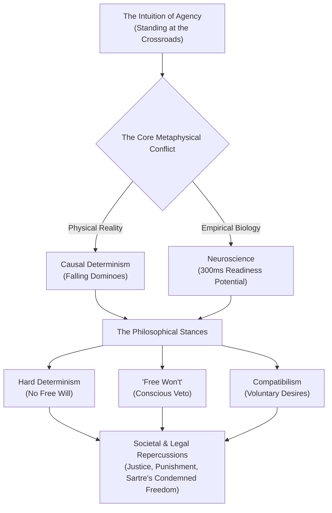

# 🧠 Free Will: Real or Fake?
## Formal Lecture Documentation & Conceptual Architecture

> **Document Class:** Academic Lecture Monograph & Curriculum Guide  
> **Topic:** Metaphysics, Cognitive Neuroscience, and Moral Philosophy  
> **Core Inquiry:** Do human beings exercise genuine autonomous agency in their choices, or is conscious volition an illusory byproduct of deterministic physical, biological, and historical chains of causality?

---

## 📑 Table of Contents
1. [Lecture Overview & Executive Summary](#1-lecture-overview--executive-summary)
2. [Module 1: Defining Free Will & The Phenomenon of Choice](#2-module-1-defining-free-will--the-phenomenon-of-choice)
3. [Module 2: The Architecture of Determinism](#3-module-2-the-architecture-of-determinism)
4. [Module 3: Cognitive Neuroscience & The 300ms Time Gap](#4-module-3-cognitive-neuroscience--the-300ms-time-gap)
5. [Module 4: The Trilemma — Three Major Philosophical Stances](#5-module-4-the-trilemma--three-major-philosophical-stances)
6. [Module 5: Societal, Legal, and Ethical Repercussions](#6-module-5-societal-legal-and-ethical-repercussions)
7. [Module 6: The Existential Dimension — Sartre and the Burden of Choice](#7-module-6-the-existential-dimension--sartre-and-the-burden-of-choice)
8. [Pedagogical Prompts & Discussion Questions](#8-pedagogical-prompts--discussion-questions)
9. [Key Terms & Conceptual Glossary](#9-key-terms--conceptual-glossary)

---

## 1. Lecture Overview & Executive Summary

The debate over free will stands at the intersection of classical metaphysics, modern cognitive neurobiology, and legal jurisprudence. At stake is nothing less than the legitimacy of moral responsibility, retributive justice, personal accountability, and the subjective understanding of human consciousness.

### The Central Thesis
While human beings possess an intuitive, phenomenological certainty of autonomy—experiencing themselves as the deliberate authors of their actions—contemporary physical determinism and empirical neuroscience suggest that unconscious neural precursors initiate behavior well before conscious awareness dawns. This lecture presents the evidence, examines the counterarguments, and evaluates whether human agency is **real, fake, or redefined**.



---

## 2. Module 1: Defining Free Will & The Phenomenon of Choice

### 2.1 The Crossroads Thought Experiment
Consider an individual standing at a physical fork in the road:
* To the left lies path $A$; to the right lies path $B$.
* The traveler pauses, contemplates both alternatives, and chooses path $A$.
* In retrospect, the traveler feels an unshakable conviction: *"I could have chosen $B$ under the exact same circumstances."*

This subjective conviction is the **phenomenology of agency**. It is defined as:
> **Free Will:** The capacity of an agent to formulate desires, deliberate among alternate possibilities, and select an action without being coerced or predetermined by prior external causes or unconscious biological mechanisms.

### 2.2 The Fundamental Inquiry
Is this internal feeling of deliberate control an **accurate reflection of metaphysical autonomy**, or is it an **evolutionary post-hoc narrative** generated by the conscious mind to explain actions already initiated by unconscious physiological processes?

---

## 3. Module 2: The Architecture of Determinism

### 3.1 The Principle of Universal Causality
Determinism posits that the universe is governed by unbroken laws of cause and effect. Every current state of affairs is the necessary consequence of preceding states and fundamental physical constants.

$$	ext{State}_{t} = f(	ext{State}_{t-1}, 	ext{Physical Laws})$$

### 3.2 The Domino Analogy
Imagine a sequential line of standing dominoes:
1. When the first domino is tipped, an unbroken cascade of kinetic transfer propagates down the line.
2. The final domino collapses inevitably.
3. The final domino **does not choose** to fall; it is compelled by the impact of the domino immediately behind it, which was compelled by the one before it.

```
[Initial Cause] ──▶ [Domino 1] ──▶ [Domino 2] ──▶ ... ──▶ [Final Action]
                          (No internal choice at any step)
```

### 3.3 Application to Human Beings
Humans are macroscopic physical systems composed of cells, proteins, neurons, and biochemical electrical gradients. If every physical particle in the universe obeys deterministic physics:
* Are human decisions anything more than the latest falling domino in a causal chain stretching back to the Big Bang?
* If our neurochemistry is entirely dictated by genetics, epigenetic programming, environmental inputs, and past memories, can any choice truly be called "independent"?

---

## 4. Module 3: Cognitive Neuroscience & The 300ms Time Gap

### 4.1 The Benjamin Libet Experiments (1983)
Pioneered by neurophysiologist Benjamin Libet at UC San Francisco, these groundbreaking electroencephalogram (EEG) experiments tested the precise temporal sequence of voluntary movement:

1. **Experimental Setup:** Subjects looked at a specialized oscilloscope clock with a dot rotating every 2.56 seconds. They were instructed to flick their wrist whenever they felt the spontaneous "urge" or intention to do so.
2. **Key Timestamps Tracked:**
   - **$RP$ (Readiness Potential / *Bereitschaftspotential*):** The onset of electrical activity in the supplementary motor area (SMA) of the brain.
   - **$W$ (Will):** The exact millisecond reported by the subject when they consciously became aware of their decision to act.
   - **$M$ (Movement):** The actual muscular contraction recorded via electromyography (EMG).

### 4.2 The 300-Millisecond Time Gap
The experimental results revealed a startling discrepancy:
* The brain's motor preparation ($RP$) preceded conscious awareness of the urge ($W$) by **approximately 300 to 500 milliseconds**.
* Modern functional magnetic resonance imaging (fMRI) studies by John-Dylan Haynes (2008) at the Max Planck Institute have extended this predictive window even further: decoding decisions in the prefrontal and parietal cortex up to **7 to 10 seconds** before conscious report!

```
Temporal Sequence of Volition:
  -500ms ─────────────────────── -200ms ──────────────────────── 0ms
     │                              │                              │
  [Brain initiates              [Conscious                      [Physical
   Readiness Potential (RP)]     awareness of decision (W)]      movement occurs (M)]
     └────────── 300ms ─────────────┘
          "The Unconscious Gap"
```

### 4.3 The Critical Implication
If the physiological machinery of the brain begins executing an action hundreds of milliseconds before the conscious ego is even notified, does consciousness merely serve as a **press secretary** rationalizing decisions already made in the dark?

---

## 5. Module 4: The Trilemma — Three Major Philosophical Stances

To resolve the tension between subjective experience, deterministic physics, and neurobiology, philosophers have organized into three principal schools of thought:

| Stance | Core Proposition | Stance on Free Will | Treatment of Moral Blame |
| :--- | :--- | :---: | :--- |
| **Hard Determinism** | The universe is strictly causal. Past events, biology, and environment leave no room for alternate possibilities. | **Non-existent (Illusion)** | Incoherent; blame is irrational, though quarantine/treatment remains practical. |
| **"Free Won't"** | Unconscious impulses cannot be stopped from arising, but the conscious mind possesses a veto window before execution. | **Restricted / Negative Agency** | Maintained; moral culpability rests on the failure to exercise conscious veto. |
| **Compatibilism** | Free will does not require metaphysical indeterminism; it requires freedom from external coercion. | **Compatible with Determinism** | Fully intact; you are responsible if you acted according to your internal desires. |

### 5.1 Hard Determinism (Incompatibilism)
* **Advocates:** Baruch Spinoza, Arthur Schopenhauer, Sam Harris.
* **Core Argument:** Just as water has no choice but to freeze at 0°C, human neurobiology cannot produce any choice other than what physics and prior conditions dictate. Spinoza famously stated: *"Men believe themselves free because they are conscious of their volitions and desires, but ignorant of the causes by which they are led to desire."*

### 5.2 "Free Won't" (The Conscious Veto)
* **Advocates:** Benjamin Libet, Vilayanur Ramachandran.
* **Core Argument:** Even if the initial impulse to act arises unconsciously at $-500	ext{ ms}$, there remains a **150 to 200-millisecond window** between conscious awareness ($W$) and muscular execution ($M$). During this window, consciousness can step in and **abort** the action. Free will is not the power of initiation, but the power of inhibition.

### 5.3 Compatibilism (Soft Determinism)
* **Advocates:** David Hume, John Locke, Daniel Dennett.
* **Core Argument:** The definition of free will used by hard determinists (requiring magic or exemption from physics) is mistaken. A person acts freely as long as their action originates from their own internal beliefs, desires, and character, without external physical restraint, gun to the head, or severe psychiatric paralysis.

---

## 6. Module 5: Societal, Legal, and Ethical Repercussions

The theoretical debate has immediate, practical consequences for human civilization:

### 6.1 The Foundations of Criminal Justice
Our legal systems are historically built upon **retributive justice**: the doctrine that an offender deserves punishment because they freely chose to commit a wrongful act.
* **The Deterministic Challenge:** If a violent criminal's behavior was the mathematical outcome of traumatic childhood abuse, genetic vulnerability, and neurochemical imbalances (the domino effect), is retributive punishment morally justifiable?
* **The Utilitarian Shift:** If hard determinism is true, the legal system must abandon retribution in favor of:
  1. **Quarantine:** Detaining dangerous individuals for public safety (comparable to quarantining a virus carrier without moral hatred).
  2. **Deterrence:** Maintaining predictable consequences to alter future behavioral dominoes.
  3. **Rehabilitation:** Treating underlying neurological and social pathologies.

---

## 7. Module 6: The Existential Dimension — Sartre and the Burden of Choice

### 7.1 "Man is Condemned to Be Free"
French existentialist Jean-Paul Sartre offered a counterweight to mechanistic fatalism in *Being and Nothingness* (1943):
> *"Man is condemned to be free; because once thrown into the world, he is responsible for everything he does."*

### 7.2 Radical Responsibility and "Bad Faith" (*Mauvaise Foi*)
* Even if one's circumstances (facticity) are unchosen—birthplace, physical body, past trauma—the individual is perpetually forced to **assign meaning** and **choose their next response**.
* Refusing to choose is, in itself, a choice.
* Blaming our choices entirely on our past, our biology, or societal pressure is what Sartre called **Bad Faith**: an inauthentic attempt to escape the crushing anxiety (*angst*) of absolute personal responsibility.

---

## 8. Pedagogical Prompts & Discussion Questions

For seminars, classrooms, and self-directed inquiries:

1. **The Libet Dilemma:** If a brain scanner could predict with 100% accuracy which button you will press 10 seconds before you feel you decided, would that definitively disprove your free will? Why or why not?
2. **The Justice Paradox:** If a judge completely accepts hard determinism, how should they sentence an individual convicted of a premeditated crime?
3. **The Pragmatic Question:** Is belief in free will a necessary social fiction? Research indicates that individuals prompted with deterministic arguments exhibit higher rates of cheating and lower altruism. Does society require the illusion of agency to function?
4. **The Veto Test:** Think back to a moment you stopped yourself from saying something cruel. Did that veto originate from a conscious "Free Won't", or was the veto itself just another domino triggered by past conditioning?

---

## 9. Key Terms & Conceptual Glossary

* **Agency:** The capacity of an actor to act purposefully in any given environment.
* **Bereitschaftspotential (Readiness Potential):** A measure of activity in the motor cortex and supplementary motor area of the brain leading up to voluntary muscle movement.
* **Compatibilism:** The belief that free will and deterministic causality are mutually compatible concepts.
* **Determinism:** The philosophical proposition that every event, including human cognition and action, is causally determined by an unbroken chain of prior occurrences.
* **Epiphenomenalism:** The view that mental events are caused by physical events in the brain, but have no causal efficacy upon physical events themselves.
* **Facticity:** Sartre's term for the concrete given realities of a person's situation (e.g., historical epoch, birth attributes) which they did not choose.
* **Hard Determinism:** The position that universal determinism is true and precludes the possibility of free will.
* **Libet Clock:** The rotating visual apparatus utilized in Benjamin Libet's 1983 experiments to synchronize subjective conscious intention with neuroelectric telemetry.
